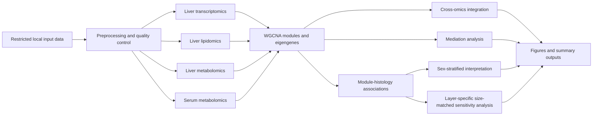

# MASLD Sex-Stratified Multi-Omics Analysis

[](https://www.r-project.org/)
[](LICENSE)
[](https://github.com/shashank-KU/masld-sex-stratified-multiomics)
[](#data-availability-and-privacy)
[](MASLD_complete_analysis.Rmd)

A reproducible R workflow for sex-stratified multi-omics analysis of metabolic dysfunction-associated steatotic liver disease (MASLD). The workflow integrates liver transcriptomics, liver lipidomics, liver metabolomics, and serum metabolomics to evaluate molecular modules, histological associations, cross-omics relationships, mediation patterns, and sample-size sensitivity.

> **Repository scope:** This public repository contains analysis code, documentation, and approved figures only. Individual-level phenotype and omics data are not included because public release is restricted.

## Contents

- [Scientific scope](#scientific-scope)
- [Analysis overview](#analysis-overview)
- [Repository structure](#repository-structure)
- [Software environment](#software-environment)
- [Running the workflow](#running-the-workflow)
- [Expected outputs](#expected-outputs)
- [Data availability and privacy](#data-availability-and-privacy)
- [Reproducibility and quality control](#reproducibility-and-quality-control)
- [Responsible interpretation](#responsible-interpretation)
- [Citation](#citation)
- [License](#license)
- [Contact](#contact)

## Scientific scope

The workflow evaluates molecular patterns associated with three liver histological features:

- steatosis;
- inflammation;
- fibrosis.

Four omics layers are integrated:

| Abbreviation | Omics layer | Biological source |
|---|---|---|
| SMC | Serum metabolomics | Serum |
| MC | Metabolomics | Liver biopsy |
| LC | Lipidomics | Liver biopsy |
| TC | Transcriptomics | Liver biopsy |

The repository supports the following analytical objectives:

1. characterize clinical and histological features;
2. preprocess and quality-control multi-omics datasets;
3. identify omics modules using weighted correlation network analysis;
4. calculate module eigengenes and hub features;
5. evaluate module-histology associations;
6. perform sex-stratified analyses;
7. visualize significant associations using heatmaps and chord diagrams;
8. evaluate cross-omics correlations;
9. conduct differential and pathway-enrichment analyses;
10. assess mediation patterns across molecular layers;
11. evaluate sensitivity to unequal sample size and layer-specific data availability.

## Analysis overview



### Core analytical methods

- **Network analysis:** WGCNA with biweight midcorrelation and signed networks.
- **Module associations:** Spearman correlations between module eigengenes and histological traits.
- **Multiple testing:** false discovery rate adjustment, with the threshold defined in the analysis script and manuscript.
- **Transcriptomics:** STAR and RSEM preprocessing followed by DESeq2-based normalization and differential analysis.
- **Pathway analysis:** clusterProfiler for transcriptomic enrichment and MetaboAnalyst for metabolic pathway analysis.
- **Mediation:** regression-based mediation analysis using the `mediation` R package.
- **Visualization:** `ggplot2`, `circlize`, `pheatmap`, `ggalluvial`, `cowplot`, and `patchwork`.

## Main analysis file

The complete workflow is provided in:

```text
MASLD_complete_analysis.Rmd
```

The R Markdown document is the authoritative analysis source in this repository.

## Repository structure

```text
masld-sex-stratified-multiomics/
├── README.md
├── LICENSE
├── MASLD_complete_analysis.Rmd
└── Figures/
```

Restricted data directories are intentionally excluded from the public repository. The workflow expects authorized input files to be available locally in the directory structure referenced by the R Markdown document.

## Software environment

The analysis was conducted in **R 4.4.1**. Major analytical packages include:

| Package or software | Version used | Primary purpose |
|---|---:|---|
| WGCNA | 1.73 | Network construction and module eigengenes |
| psych | 2.4.6.26 | Correlation analysis |
| limma | 3.60.4 | Linear-model analysis |
| DESeq2 | 1.44.0 | RNA-seq normalization and differential analysis |
| clusterProfiler | 4.12.6 | Functional enrichment |
| mediation | 4.5.0 | Mediation analysis |
| circlize | 0.4.16 | Chord diagrams |
| ggplot2 | 3.5.1 | Statistical visualization |
| POMA | 1.14.0 | Metabolomics data handling and preprocessing |
| ggalluvial | 0.12.5 | Alluvial visualizations |
| patchwork | 1.2.0 | Multipanel figure assembly |
| cowplot | 1.1.3 | Plot alignment and figure assembly |
| pheatmap | 1.0.12 | Heatmaps |
| MetaboAnalystR | 4.0.0 | Metabolomics analysis support |

Additional software used upstream includes ProteoWizard/MSConvert, MZmine, STAR, RSEM, and MetaboAnalyst. Exact versions and citations are reported in the manuscript Key Resources Table where available.

For exact dependency and platform information, add a `sessionInfo.txt` file generated from the final analysis environment:

```r
writeLines(
  capture.output(sessionInfo()),
  "sessionInfo.txt"
)
```

For stronger environment reproducibility, create an `renv.lock` file from the final working R environment:

```r
install.packages("renv")
renv::init()
renv::snapshot()
```

## Running the workflow

### 1. Clone the repository

```bash
git clone https://github.com/shashank-KU/masld-sex-stratified-multiomics.git
cd masld-sex-stratified-multiomics
```

### 2. Prepare authorized local inputs

Place authorized data files in the local folders expected by `MASLD_complete_analysis.Rmd`. Do not place restricted participant-level files in the Git working tree unless the files are explicitly excluded and repository access is appropriately controlled.

### 3. Review paths and parameters

Open `MASLD_complete_analysis.Rmd` and verify:

- input directory paths;
- output directory paths;
- software-specific file locations;
- analysis parameters;
- availability of all required R and Bioconductor packages.

### 4. Render the analysis

From R:

```r
rmarkdown::render(
  input = "MASLD_complete_analysis.Rmd"
)
```

Or from a shell with R available:

```bash
Rscript -e 'rmarkdown::render("MASLD_complete_analysis.Rmd")'
```

### 5. Review generated content before committing

Inspect all rendered reports, tables, figures, caches, and logs for:

- participant or sample identifiers;
- individual-level clinical or omics values;
- restricted filenames;
- local user paths;
- temporary files;
- unexpectedly large outputs.

## Expected outputs

Depending on the available inputs and enabled analysis chunks, the workflow can generate:

- cohort summary tables;
- soft-threshold diagnostic plots;
- WGCNA module and eigengene summaries;
- module-histology correlation heatmaps;
- sex-stratified chord diagrams;
- cross-omics correlation outputs;
- differential-analysis tables;
- pathway-enrichment plots;
- mediation summaries and alluvial plots;
- layer-specific size-matched sensitivity distributions;
- manuscript and supplementary figures.

Approved figures can be stored in the `Figures/` directory. Generated participant-level or intermediate outputs must remain outside the public repository.

## Data availability and privacy

Individual-level clinical and omics datasets are not distributed through this repository. Publicly available code does not confer access to restricted study data.

Do not commit:

- participant identifiers or sample keys;
- clinical metadata;
- raw or normalized omics matrices;
- sample-level intermediate objects;
- spreadsheets containing individual-level observations;
- unreviewed rendered reports;
- R caches or serialized workspaces containing restricted data;
- access credentials, tokens, or local configuration secrets.

A suitable `.gitignore` should exclude restricted data and derived sample-level files. At minimum, consider:

```gitignore
# Restricted data
Analyisis/
Analysis_Polars_Semipolars/
Analysis_Serum_Polars_Semipolars/
Analysis_PFAS/
Transcriptomics/
data/
raw_data/
private_data/

# R state and caches
.Rhistory
.RData
.Ruserdata
.Rproj.user/
*_cache/
*_files/

# Potentially sensitive outputs
results/
*.rds
*.RDS
*.xlsx
*.csv

# Operating-system and temporary files
.DS_Store
Thumbs.db
~$*
```

Review every exception before using `git add -f`.

## Reproducibility and quality control

The workflow includes reproducibility controls designed for the reported analyses:

- explicit package and software versions;
- fixed random seeds for stochastic analyses;
- validation of sample overlap and uniqueness;
- layer-specific accounting for omics availability;
- recalculation checks against observed association counts;
- raw resampling-distribution export where enabled;
- multiple-testing correction within defined analysis families;
- separation of public code from restricted data.

Recommended additions before creating an archival release:

- `sessionInfo.txt`;
- `renv.lock`;
- `CITATION.cff`;
- a tagged GitHub release;
- a permanent Zenodo archive and DOI;
- a concise changelog documenting the manuscript-associated release.

## Responsible interpretation

This workflow supports exploratory and discovery-oriented multi-omics analyses. Results should be interpreted in the context of the study design, unequal group sizes, layer-specific missingness, multiple testing, and the availability of independent validation.

Sex-stratified findings describe associations in the analyzed cohort. The size-matched sensitivity analysis evaluates the number of detected module-histology associations after accounting for sample size and layer-specific availability. The analysis does not, by itself, establish an intrinsic biological difference in network architecture.

## Code availability statement

The complete analysis workflow is publicly available in this repository:

[MASLD sex-stratified multi-omics analysis repository](https://github.com/shashank-KU/masld-sex-stratified-multiomics)

For publication, cite a versioned archival DOI once the manuscript-associated release has been deposited in Zenodo. The GitHub repository can remain the actively maintained version.

## Citation

Until the associated manuscript and archival DOI are available, use:

```text
Gupta S. MASLD Sex-Stratified Multi-Omics Analysis. GitHub repository.
https://github.com/shashank-KU/masld-sex-stratified-multiomics
```

After publication, replace the temporary citation with the full manuscript citation and archived software DOI. A `CITATION.cff` file should be added at that stage so GitHub can display the preferred citation.

## License

This repository is distributed under the [MIT License](LICENSE). The license applies to repository code and documentation only. It does not grant access to, or permission to redistribute, restricted participant-level data.

## Author

**Shashank Gupta**  
Örebro University  
[GitHub profile](https://github.com/shashank-KU)  
[Örebro University profile](https://www.oru.se/english/employee/shashank_gupta)

## Contact

For questions about the analysis workflow, open a [GitHub issue](https://github.com/shashank-KU/masld-sex-stratified-multiomics/issues). Do not include participant-level information, restricted data, credentials, or confidential study details in public issues.

## Acknowledgment

When reusing or adapting this workflow, cite the associated manuscript and the archived software release when available. Please also cite the original software publications listed in the manuscript Key Resources Table.
